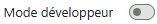
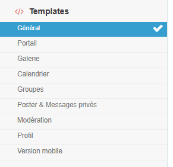
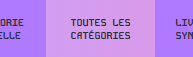

#  Pimp my Admin 

Tu es fondateurice d'un forum forumactif et t'as envie de te simplifier la vie ? 

Pimp my Admin est là pour toi ! Il s'agit d'une extension pour navigateur (uniquement chrome pour le moment) qui permet de synchroniser facilement les templates actuellement en ligne sur ton forum, et ceux disponibles localement sur ta machine — dans un sens, ou dans l'autre.

> ⚠️ L'extension reste non publiée sur le Chrome Store pendant la phase de développement — tu peux l'installer en dev mode nativement en téléchargeant la dernière release.


## Installation

1. Télécharge la dernière version depuis l'onglet [**Releases**](../../releases) de ce repo (`pimp-my-admin_X.X.X.zip`). [Raccourci du zip](https://github.com/violette-bleue/pimp-my-admin/releases/download/v0.1.0/pimp-my-forum_0.1.0.zip)
2. Dézippe le dossier où tu veux le garder (il doit rester en place : Chrome éxécute l'extension depuis ce dossier).
3. Ouvre `chrome://extensions` depuis la barre d'adresse.
4. Active le **mode développeur**  → 
5. Clique sur `Charger l'extension non empaquetée` → sélectionne le dossier où tu as dézippé l'extension.

### Alternative : via git (pour rester à jour plus facilement)

Si tu es à l'aise avec git, tu peux cloner directement ce repo au lieu de télécharger un zip à chaque nouvelle version :

```
git clone https://github.com/violette-bleue/pimp-my-admin.git
```

Puis charge le dossier cloné comme extension non empaquetée (étapes 3 à 5 ci-dessus).

Pour mettre à jour :

```
git pull
```

Après un `pull`, l'extension devrait se mettre à jour seule après un refresh de page si elle tourne déjà. Si ce n'est pas le cas, retourne sur `chrome://extensions` et clique sur l'icône ⟳ (recharger) de l'extension pour que les changements soient pris en compte.

> ⚠️ même si je fais le maximum pour que ce soit robuste et sans bug, ça reste une première version : je te conseille de sauvegarder régulièrement un backup de tes templates au cas où (avec l'option "exporter" de l'extension ce sera plus facile qu'il n'y parait !)

Aucune configuration supplémentaire n'est nécessaire pour commencer. ♥


## Fonctionnalités

L'extension apparaît automatiquement sur les pages de gestion des templates (`Affichage > Templates`). 


### 📁 **Dossier local** 
L'arborescence suit toujours la même logique : un sous-dossier par catégorie, un fichier `.html` par template :



 ```
  mon-theme/
  ├── general/
  ├── portail/
  ├── galerie/
  ├── calendrier/
  ├── groupes/
  ├── poster-mp/
  ├── moderation/
  ├── profil/
  └── version-mobile/
  ```


### 📤 Publication de template simplifiée

Tous les templates `en attente de publication` peuvent être mis à jour en un clic.

### 🔍 Scan de la totalité des templates

L'onglet  analyse l'ensemble des catégories (~150 templates) en une fois, sans quitter la page, et permet ensuite de mettre à jour et/ou publier les templates via un bouton unique.

### ⬇️ Export forumactif → dossier local

Permet de récupérer le contenu de chaque template actuellement en ligne sur ton forum et l'écrit dans le dossier local, structuré par catégorie, au format `.html` — pratique pour sauvegarder un thème existant et éventuellement le partager.

> ⚠️ attention toutefois, l'opération écrasera les fichiers qui auraient le même nom qu'un template exporté.

### 🚦 Mode live sync

Une fois le mode activé, il permettra de mettre à jour (et publier si l'option est sélectionnée) de façon **automatique** toute modification d'un fichier template `.html`. Pensé pour les dev qui veulent contrôler les choses régulièrement sur le forum et évacuer une partie des manipulations nécessaires pour modifier ses templates.

## Sécurité & confidentialité

- **Aucun identifiant stocké** : l'extension ne demande ni ne conserve aucun mot de passe ni token. Elle s'appuie sur ta session Forumactif déjà ouverte dans le navigateur. D'ailleurs elle a besoin que l'onglet reste ouvert dans le panneau d'administration pour fonctionner.
- **Aucun code distant exécuté** : tout contenu récupéré (pages FA, fichiers `.html` de template) est traité comme du *texte*, jamais évalué comme script, donc jamais accessible pour quiconque.
- **Permissions demandées** : accès au dossier local que *tu* choisis explicitement ; accès réseau à `*.forumactif.com/admin/*`, et dans le futur à `api.github.com` et `raw.githubusercontent.com` pour faire le lien avec une bibliothèque de thèmes "par défaut" pour l'extension.

## Crédits

Icônes de l'interface : [Icons8](https://icons8.com/icons).
